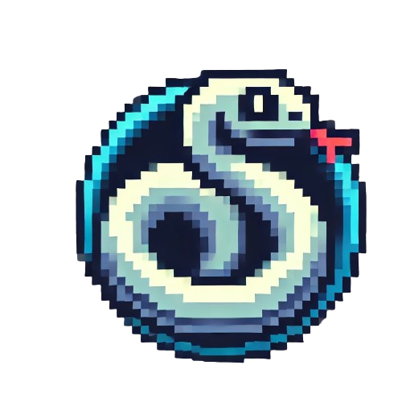

<p align="center">
  
</p>


# CPPND: Capstone Snake Game

This repository hosts an enhanced version of the classic Snake Game, which was originally developed as a capstone project for the [Udacity C++ Nanodegree program](https://www.udacity.com/course/c-plus-plus-nanodegree--nd213). The modifications introduced aim to improve game performance, user experience, and code maintainability.

<p align="center">
  
</p>


# Key Features and Enhancements

- **Improved Data Handling**: Transition from `std::vector` to `std::deque` for snake body management, optimizing the game's performance by facilitating quicker modifications to the snake's length.
- **Enhanced Modularity**: Refactoring of the rendering process into distinct functions, improving the code structure and readability, making it easier to update or modify graphics handling.
- **Memory Management**: Implementation of smart pointers (`std::unique_ptr`) across the project to ensure robust memory management and to prevent memory leaks.
- **Interactive Game Dialogs**: Introduction of interactive dialogs that engage the player at the end of each game, offering options to replay or exit, which enhances user engagement.
- **Visual Upgrades**: Addition of a static background to enrich the visual experience and give the game a more polished look.
- **Concurrency Management**: Integration of multithreading for handling game over scenarios, which allows the game to remain responsive during interactive dialog display. A mutex (`std::mutex`) is used to protect shared game state modifications between the main game loop and the game over thread, ensuring safe and correct game state updates.


# Loops, Functions, I/O - meet at least 2 criteria

- Rubric Point 1/4: The project demonstrates an understanding of C++ functions and control structures.

    - The Renderer class (renderer.cpp) demonstrates a clear organizational structure by dividing the rendering tasks into separate functions for rendering the snake and the food, each managed by a specific function (RenderFood and RenderSnake).

- Rubiric 3/4: The project accepts user input and processes the input.

    - Hass been added a new user input in class gameoverhandler.cpp. In this case add a dialout to choose beetwen still playing or not.

- Rubric Point 4/4: The project uses data structures and immutable variables.

    - The project uses std::deque to manage the snake's body. This choice is optimal for the snake game mechanics, as it allows for efficient additions and removals of elements from both ends of the deque.

- Rubric 

# Object Oriented Programming - meet at least 3 criteria

- Rubric 1/6: One or more classes are added to the project with appropriate access specifiers for class members.

    - The class GameOverHandler (gameoverhandler.cpp) has been added to the project.

- Rubric 2/6: Class constructors utilize member initialization lists.

    - All has been modify it to do it. An exmaple is file renderer.cpp (line 14) where has been added "background_texture" initialization.

- Rubric 3/6: Classes abstract implementation details from their interfaces.

    - In all classes has been added documentation. E.g.: snake.h

# Memory Management - meet at least 3 criteria

- Rubric 1/6: The project makes use of references in function declarations.

    - Use of pass-by-reference examples in:
        
        - renderer.h -> Function "ShowGameOverMessage".
        - renderer.h -> Functions "DrawFood" / "DrawSnake"

- Rubric 2/6: The project uses destructors appropriately.

    - Game class (game.cpp) use the destructor to performs cleanup by calling Cleanup.

- Rubric 6/6: The project uses smart pointers instead of raw pointers.

    - Has been added smart pointers in classes like game.h in line 66, renderer.h in lines 75-77.

# Concurrency - meet at least 2 criteria

- Rubric 1/4: The project uses multithreading.

    - The project uses async tasks in the game class (game.h) in line 67. Also add the clearing of thread in the destructor.

- Rubric 3/4: A mutex or lock is used in the project.

    - It is implemented in game class, which utilizes mutex locking to safely update and check game state variables shared with the main thread.

# Dependencies for Running Locally
* **cmake >= 3.7**
  * All OSes: [click here for installation instructions](https://cmake.org/install/)
* **make >= 4.1** (Linux, Mac), 3.81 (Windows)
  * Linux: make is installed by default on most Linux distros
  * Mac: [install Xcode command line tools to get make](https://developer.apple.com/xcode/features/)
  * Windows: [Click here for installation instructions](http://gnuwin32.sourceforge.net/packages/make.htm)
* **SDL2 >= 2.0**
  * All installation instructions can be found [here](https://wiki.libsdl.org/Installation)
  >Note that for Linux, an `apt` or `apt-get` installation is preferred to building from source. 
* **gcc/g++ >= 5.4**
  * Linux: gcc / g++ is installed by default on most Linux distros
  * Mac: same deal as make - [install Xcode command line tools](https://developer.apple.com/xcode/features/)
  * Windows: recommend using [MinGW](http://www.mingw.org/)
* **SDL2_image >= 2.0** (supports PNG and JPG formats)
  * All OSes: [click here for installation instructions](https://www.libsdl.org/projects/SDL_image/)
  * Linux: `sudo apt-get install libsdl2-image-dev`
  * Mac: Use Homebrew `brew install sdl2_image`
  * Windows: Available through [SDL2_image development libraries](https://www.libsdl.org/projects/SDL_image/)
* **Zenity >= 3.32**
  * Linux: `sudo apt-get install zenity`


# Basic Build Instructions

Follow these simple steps to get your game up and running:

1. **Clone the repository:**
   ```bash
   git clone https://github.com/mkassimi98/CppND-Capstone-Snake-Game.git
   ```
   
2. **Create and navigate to the build directory:**
   ```bash
   mkdir build && cd build
   ```

3. **Compile the project:**
   ```bash
   cmake .. && make
   ```
   This command will configure the project and build the executable.

4. **Run the game:**
   ```bash
   ./SnakeGame
   ```


# Pseudo-code

### 1. **Game Loop**

The main game loop handles the cycle of input processing, game state updating, and rendering:

```plaintext
Initialize game components
While game is running
    Process Input
        If 'QUIT' event is triggered
            Terminate game
        Else if 'KEYDOWN' event
            Update Snake Direction based on arrow key input
        EndIf
    EndProcess

    Update Game State
        Move Snake based on current direction
        If Snake eats food
            Increase Score and Snake Size
            Speed up Snake
            Generate new food position
        If Snake collides with wall or itself
            Trigger Game Over
        EndIf
    EndUpdate

    Render Game
        Draw Snake and Food on screen
    EndRender

    Delay frame to control game speed
EndWhile

Clean up resources and exit
```

### 2. **Snake Movement and Direction Change**

Detailing how the snake's movement and direction changes are handled:

```plaintext
Procedure ChangeDirection
    Input: current direction, new direction
    If new direction is valid (not opposite to current direction)
        Update snake's direction
EndProcedure

Procedure MoveSnake
    Based on the snake's current direction
    Update head position
    Add new head position to snake body
    If snake did not eat food
        Remove the last segment of the snake body
    Else
        Keep the snake body as is (to grow)
    EndIf
EndProcedure
```

### 3. **Food Placement and Collision Check**

Explaining how food is placed and collisions are detected:

```plaintext
Procedure PlaceFood
    Randomly select a grid position
    If position is not occupied by the snake
        Place food at this position
    Else
        Repeat until an unoccupied position is found
EndProcedure

Function CheckCollision
    If snake's head position matches any body part
        Return true (collision with itself)
    If snake's head position is out of game bounds
        Return true (collision with wall)
    Return false (no collision)
EndFunction
```

### 4. **Game Over Handling**

Describing the game-over scenario:

```plaintext
Procedure GameOver
    Display game-over message and score
    Ask player if they want to restart
    If yes
        Reset game state and start new game
    If no
        Exit game
EndProcedure
```

# Tutorial for Snake Game

Welcome to the Snake Game! This classic game challenges your quick thinking and reflexes. Below, you'll find everything you need to start playing and enjoying the game.

### Objectives

The main objective of the Snake Game is to eat as many pieces of food as possible to grow the snake's length. Each piece of food the snake eats will increase its length and your score. The game continues until the snake either runs into the wall or collides with itself.

### Controls

- **Arrow Up**: Move the snake upwards.
- **Arrow Down**: Move the snake downwards.
- **Arrow Left**: Move the snake to the left.
- **Arrow Right**: Move the snake to the right.

Pressing any of the arrow keys will change the direction of the snake's head, and the snake will then continue moving in that direction.

### Starting the Game

1. **Open the Game**: Launch the game by executing the `./SnakeGame` in the game's build directory.
2. **Begin Playing**: Once the game starts, use the arrow keys to control the snake.

### Gameplay Tips

- **Plan Ahead**: As the snake gets longer, planning your moves in advance becomes crucial to avoid trapping yourself.
- **Use the Edges and Corners**: Making use of the entire play area can help in avoiding collisions with the snake's body.
- **Speed Control**: Remember, as your score increases, so does the speed of the snake, requiring quicker reactions and more precise controls.

### Ending the Game

The game ends when the snake collides with the wall or with its own body. At the end of each game, you'll see your final score based on the length of the snake and the number of foods eaten.

### Restarting the Game

After the game ends, you will be prompted to restart the game or exit. You can choose to try again to beat your high score or exit the game.

🎉 **Enjoy playing Snake! Dive into the fun immediately after the build completes!** 🎉

# Credits

This project was developed by [Your Name]. Special thanks to all the contributors and supporters of the project.

## Acknowledgments

- Thanks to [Udacity](https://www.udacity.com/) for providing the initial project framework and educational support.
- Appreciation to the open-source community for continuous inspiration and collaboration.
- The images used in this project has been generated with AI.

## Contact Information

For any inquiries, feedback, or contributions, please contact me at:

- **Email**: mouhsine98@gmail.com
- **GitHub**: [mkassimi98](https://github.com/mkassimi98)
- **LinkedIn**: [Mouhsine Kassimi](www.linkedin.com/in/mouhsine-kassimi-farhaoui-983738163)

---

# CC Attribution-ShareAlike 4.0 International


Shield: [![CC BY-SA 4.0][cc-by-sa-shield]][cc-by-sa]

This work is licensed under a
[Creative Commons Attribution-ShareAlike 4.0 International License][cc-by-sa].

[![CC BY-SA 4.0][cc-by-sa-image]][cc-by-sa]

[cc-by-sa]: http://creativecommons.org/licenses/by-sa/4.0/
[cc-by-sa-image]: https://licensebuttons.net/l/by-sa/4.0/88x31.png
[cc-by-sa-shield]: https://img.shields.io/badge/License-CC%20BY--SA%204.0-lightgrey.svg
